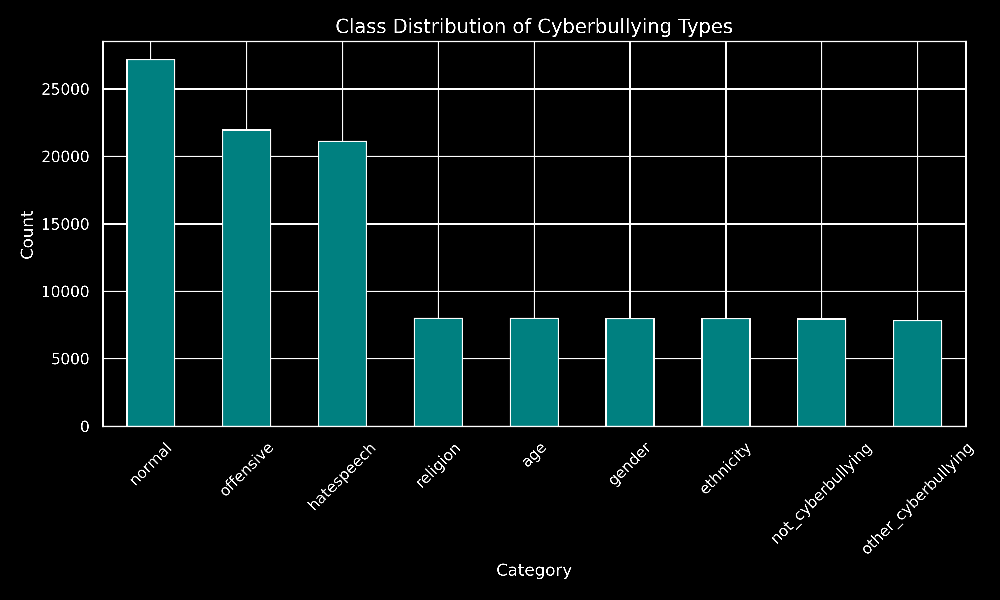
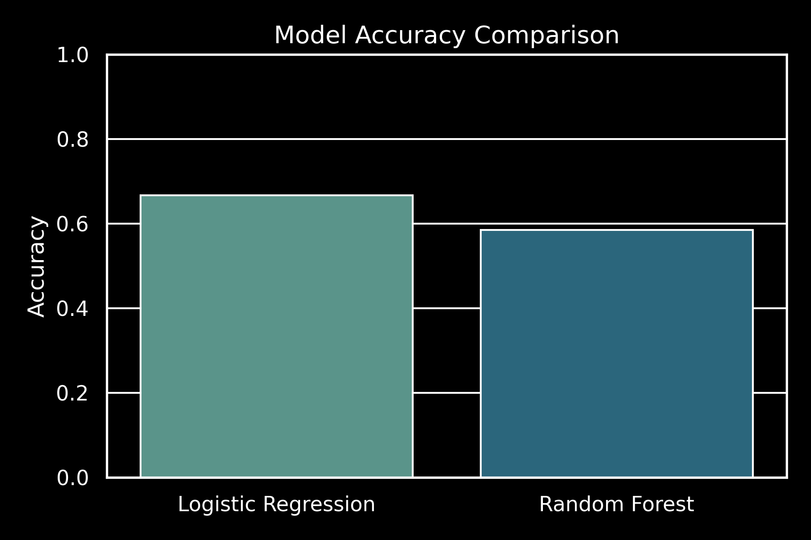
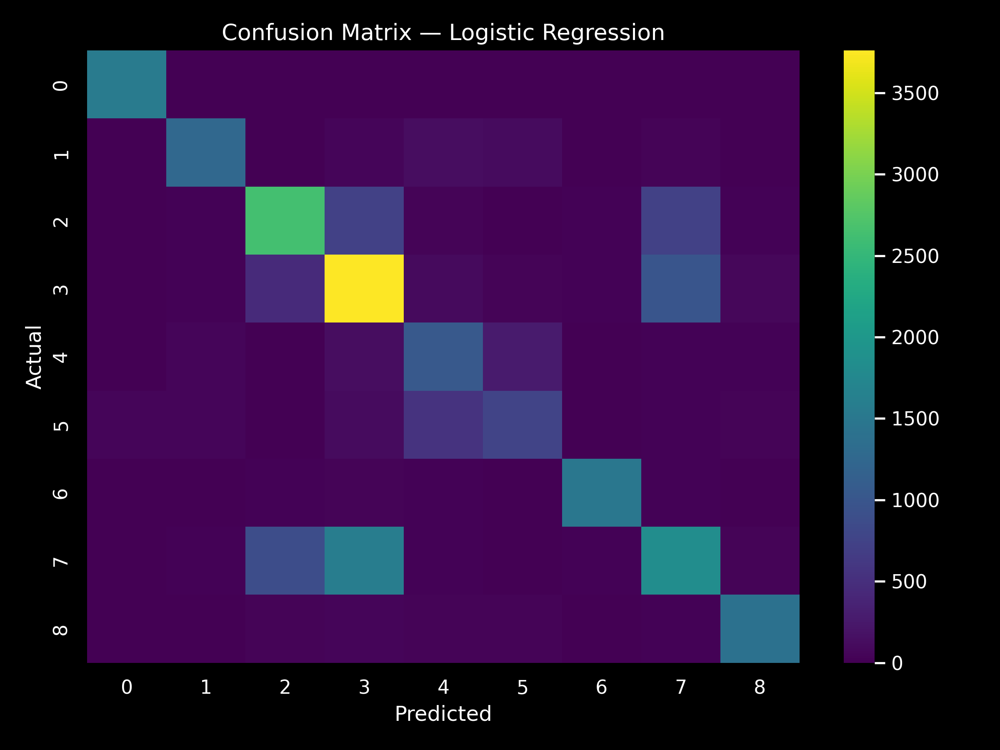

# 🧠 Cyberbullying Comment Classifier

A **machine learning project** designed to detect and classify **cyberbullying comments** across social media posts using **TF-IDF features** and two optimized models — **Logistic Regression** and **Random Forest**.  
Built with a focus on **speed, interpretability, and real-world usability**.

---

## 🌍 Project Overview

Cyberbullying remains a major concern in digital communication.  
This project demonstrates a **text classification pipeline** that can automatically categorize online comments into specific bullying types such as **age, gender, religion, ethnicity**, and more.

The dataset used combines:
- `cyberbullying_tweets.csv`
- `cyberbullying_dataset.csv`

Both merged and cleaned for balanced representation.

---

## 📊 Exploratory Data Analysis

<p align="center">
  
</p>

---

## ⚙️ Model Architecture

Text preprocessing → TF-IDF Vectorization → Dual Model Comparison

- **Model 1:** Logistic Regression (fast, interpretable baseline)  
- **Model 2:** Random Forest (non-linear, ensemble approach)

<p align="center">
  
</p>

---

## 📈 Model Performance

| Model | Accuracy | Strengths |
|:------|:----------|:-----------|
| Logistic Regression | **64.73%** | Fast training and good generalization |
| Random Forest | **58.07%** | Better on complex relations, but slower |

<p align="center">
  
</p>

---

## 🧪 Key Observations

- **Logistic Regression** performed best overall (65% accuracy).
- **Random Forest** struggled with unbalanced labels but showed strong recall in a few minority classes.
- Text normalization and stopword removal were critical to improving accuracy.

---

## 📁 Project Structure

├── artifacts/
│ ├── LogisticRegression_fast.joblib
│ ├── RandomForest_fast.joblib
│ └── vectorizer_fast.joblib
├── images/
│ ├── eda_dark.png
│ ├── model_dark.png
│ └── confusion_dark.png
├── cyberbullying_tweets.csv
├── cyberbullying_dataset.csv
├── generate_images_and_readme.py
├── main_pipeline.py
└── README.md


---

## 🧩 Tech Stack

- **Python 3.x**
- **Pandas**, **NumPy**, **Scikit-learn**
- **Matplotlib / Seaborn**
- **NLTK**
- **Joblib**

---

## 🚀 Usage

To run the main pipeline:

```bash
python main_pipeline.py
Or, to regenerate visuals and update documentation:

bash
Copy code
python generate_images_and_readme.py
Outputs:

artifacts/ → trained models

images/ → visualization set

README.md → updated project summary

🧠 Author
Mayuri Motwani
B.Tech, Computer Science Engineering — Data Science Lab
✨ Passionate about AI, NLP, and social good applications

🏁 Summary
This project is a foundational NLP experiment in social media analysis and automated moderation.

Future extensions include:

BERT or LSTM-based text embeddings

Real-time Streamlit dashboard

Bias and fairness analysis in language models

vbnet
Copy code

